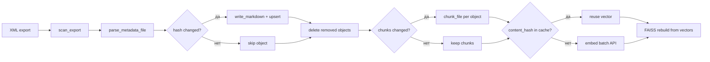

# Архитектура 1c-conf-doc

Приложение превращает XML-выгрузку конфигурации 1С (конфигуратор) в структурированную документацию и обеспечивает семантический поиск по ней. Один экземпляр сервиса может обслуживать несколько конфигураций; клиенты (CLI, HTTP API, AI-агенты) работают с единым индексом.

## Обзор

```
┌─────────────────────────────────────────────────────────────────────────┐
│                         Клиенты                                       │
│  conf-doc CLI  │  HTTP API (FastAPI)  │  AI-агенты (skills + API)     │
└────────┬───────────────────┬──────────────────────┬───────────────────┘
         │                   │                      │
         └───────────────────┼──────────────────────┘
                             ▼
                    ┌─────────────────┐
                    │    Pipeline     │  ← оркестрация index / search / RAG
                    └────────┬────────┘
         ┌───────────────────┼───────────────────┐
         ▼                   ▼                   ▼
   ┌───────────┐      ┌─────────────┐     ┌─────────────┐
   │  Parser   │      │  Markdown   │     │     RAG     │
   │  + Models │ ──►  │  Generator  │ ──► │ chunk/embed │
   └───────────┘      └──────┬──────┘     └──────┬──────┘
                               │                   │
                               ▼                   ▼
                    ┌──────────────────────────────────┐
                    │         SQLiteIndexer            │
                    │  metadata.db (все конфигурации)  │
                    └──────────────────┬───────────────┘
                                       │
                                       ▼
                              ┌─────────────────┐
                              │  FAISS index    │
                              │  per config     │
                              └─────────────────┘
```

## Слои приложения

| Слой | Пакет / модуль | Назначение |
|------|----------------|------------|
| **Точки входа** | `cli.py`, `api/` | Команды `index`, `search`, `show`, `embed`, `serve`; REST API |
| **Конфигурация** | `config.py` | `config.yaml`: пути, эмбеддинги, FAISS, LLM, API |
| **Пайплайн** | `rag/pipeline.py` | Сценарии индексации, поиска, RAG-ответа |
| **Парсинг** | `parser/` | Сканирование выгрузки, разбор XML, справка HTML |
| **Модели** | `models/metadata.py` | Pydantic-структуры метаданных |
| **Markdown** | `markdown/` | Генерация `.md` по объектам |
| **Хранение** | `storage/sqlite.py` | Схема БД, CRUD, детали объектов |
| **RAG** | `rag/` | Чанкинг, эмбеддинги, FAISS, ранжирование, LLM |
| **Утилиты** | `config_names.py`, `progress.py` | Имена конфигураций, progress bar |

## Поток индексации



1. **Configuration.xml** — имя, версия, синоним конфигурации (`upsert_configuration`).
2. **Объекты** — для каждого `*.xml` в каталогах `Catalogs/`, `Documents/`, …:
   - сравнение `content_hash` с БД (инкрементальность);
   - при изменении — парсинг, запись markdown, upsert в SQLite;
   - объекты, исчезнувшие из выгрузки, удаляются из БД (CASCADE → chunks).
3. **Чанки** — пересборка только для изменённых объектов (`_build_chunks_incremental`); при смене `max_tokens`/`overlap_tokens` или флаге `--force` — полная пересборка.
4. **Эмбеддинги** — кэш в SQLite (`embedding_cache`, ключ `content_hash` + `model`); API вызывается только для cache miss; FAISS пересобирается из собранной матрицы векторов.

Команды: `conf-doc index`, `POST /reindex`, `conf-doc embed` (только шаги 3–4). Флаг `--force` / `"force": true` — полная пересборка чанков и эмбеддингов.

## Поток поиска


1. **Семантика** — запрос → вектор → FAISS `IndexFlatIP` (cosine через L2-normalize).
2. **Лексика** — точное совпадение запроса с именем/синонимом объекта поднимает его в топ (`search_ranking.py`, `config_names.py`).
3. **Дедупликация** — один лучший чанк на объект; предпочтение блокам «Справка».
4. **Углубление** — `GET /objects/{type}/{name}` и `.../chunks/{index}` (или CLI `show`).

## Хранение данных

### Файловая система (`output/`)

```
output/
  docs/{ConfigurationName}/     # markdown по типам (documents/, catalogs/, …)
  db/metadata.db                # одна БД на все конфигурации
  vectors/{ConfigurationName}/
    index.faiss
    chunk_map.json              # vector_id → chunk_id
```

### SQLite (`metadata.db`)

| Таблица | Содержимое |
|---------|------------|
| `configurations` | Именованные конфигурации (UNIQUE по `name`) |
| `metadata_objects` | Объекты метаданных, пути к XML/md, hash |
| `attributes`, `tabular_sections`, `enum_values` | Структура объектов |
| `help_pages` | Справка (HTML → markdown) |
| `chunks` | Текстовые фрагменты для RAG, `vector_id` |
| `embedding_cache` | Кэш векторов эмбеддингов по `(config_id, content_hash, model)` |
| `index_runs` | Журнал прогонов индексации |

Связь объектов с конфигурацией: `metadata_objects.config_id → configurations.id`.

## Мультиконфигурационность

- Имя берётся из `Configuration.xml` → `Properties/Name`.
- Markdown и FAISS изолированы по каталогам `{ConfigurationName}`.
- SQLite общая; выбор конфигурации — поле `configuration` в `config.yaml` или параметр API/CLI.
- При нескольких конфигурациях в БД без явного имени — ошибка с подсказкой.

## Чанкинг

Модуль `rag/chunker.py`:

- разбор markdown по заголовкам `##`;
- **overview-чанк** (индекс 0): шапка + «Справка» + «Формы»;
- крупные секции (реквизиты, ТЧ) — с перекрытием (`overlap_tokens`);
- лимит ~`max_tokens` (оценка: длина / 4).

## Эмбеддинги

Провайдеры (`rag/embeddings/`):

| provider | Назначение |
|----------|------------|
| `openai` | OpenAI-compatible API (Polza, OpenAI, …) |
| `ollama` | Локальный Ollama |
| `sentence_transformers` | Локальные модели без API |

Размерность вектора (`dimension`) определяется провайдером и должна совпадать с FAISS-индексом. При смене модели эмбеддингов выполните `conf-doc embed`.

## FAISS (векторный индекс)

Модуль `rag/faiss_index.py`, класс `FaissIndex`. FAISS хранит **эмбеддинги чанков** и выполняет **поиск ближайших соседей** по косинусной близости. Тексты чанков остаются в SQLite; FAISS знает только числовые векторы и связь с `chunk_id`.

### Место в пайплайне

```
chunks (SQLite)  →  embed_documents()  →  np.ndarray [N × dim]
                                              ↓
                                    faiss.normalize_L2
                                              ↓
                                    Index.add(vectors)
                                              ↓
                         index.faiss + chunk_map.json
                                              ↓
query  →  embed_query()  →  search(top_k)  →  chunk_id  →  текст из SQLite
```

Построение индекса: `Pipeline.build_embeddings()` (вызывается из `index` и `embed`).  
Поиск: `Pipeline.search()` → `FaissIndex.search()`.

### Файлы на диске

Для каждой конфигурации отдельный каталог:

```
output/vectors/{ConfigurationName}/
  index.faiss       # бинарный индекс FAISS (все векторы чанков)
  chunk_map.json    # метаданные и отображение vector_id → chunk_id
```

Пример `chunk_map.json`:

```json
{
  "dimension": 1536,
  "model": "qwen/qwen3-embedding-8b",
  "built_at": "2026-06-07T12:00:00Z",
  "vector_to_chunk": {
    "0": 36949,
    "1": 36950,
    "2": 36951
  }
}
```

| Поле | Смысл |
|------|--------|
| `dimension` | Размерность вектора (зависит от модели эмбеддингов) |
| `model` | Модель эмбеддингов, использованная при построении |
| `built_at` | ISO-время последней сборки индекса |
| `vector_to_chunk` | Позиция в FAISS (`vector_id`) → `chunks.id` в SQLite |

**Важно:** `vector_id` — это порядковый номер вектора в индексе (0…N−1), а не поле `chunks.vector_id` в БД напрямую. После `build_embeddings` в SQLite записывается `chunks.vector_id = vector_id` для обратной связи.

### Типы индекса (`config.yaml` → `faiss`)

```yaml
faiss:
  index_type: flat   # flat | hnsw
  hnsw_m: 32         # только для hnsw
```

| Тип | Класс FAISS | Поиск | Когда использовать |
|-----|-------------|-------|-------------------|
| **`flat`** (по умолчанию) | `IndexFlatIP` | Точный, O(N) | До ~100–200 тыс. чанков; конфигурации ЗУП (~10–15 тыс. чанков) |
| **`hnsw`** | `IndexHNSWFlat` | Приближённый, быстрее на больших N | Очень большие индексы; `efConstruction=200`, `M=hnsw_m` |

Оба типа используют **Inner Product** (`IP`) после L2-нормализации — это эквивалент **косинусного сходства**.

### Нормализация и метрика

```python
faiss.normalize_L2(vectors)   # при build
faiss.normalize_L2(query_vec) # при search
scores, indices = index.search(query_vec, top_k)
```

- Векторы документов и запроса приводятся к единичной длине.
- `IndexFlatIP` возвращает скалярное произведение = **cosine similarity** (от −1 до 1; для типичных эмбеддингов текста — положительные значения 0…1).
- Чем выше `score`, тем ближе смысл чанка к запросу.

### Построение индекса (инкрементальные эмбеддинги)

При каждом `build_embeddings`:

1. Из SQLite читаются **все** чанки конфигурации (`get_chunks_for_embedding`), упорядоченные по `chunks.id`.
2. Для каждого чанка проверяется кэш `embedding_cache` по `(content_hash, model)`; при hit вектор берётся из БД без вызова API.
3. Только cache miss батчами отправляются в провайдер эмбеддингов (`embeddings.batch_size`, по умолчанию 32); новые векторы сохраняются в кэш.
4. Матрица `float32` формы `(N, dimension)` собирается из кэша + новых векторов и добавляется в **новый** FAISS-индекс (пересборка быстрая, ~мс для flat / ~15k чанков).
5. Сохраняются `index.faiss` и `chunk_map.json` (с полями `model`, `built_at`).
6. В SQLite обновляется `chunks.vector_id` для каждого чанка.

Повторный `index` без изменений XML: 0 вызовов API, FAISS rebuild из кэша.  
Полная пересборка: `conf-doc index --force`, `conf-doc embed --force` или смена модели/chunking-параметров (auto-detect).

### Поиск

```python
FaissIndex.search(provider, query, top_k=k)
```

1. Загрузка индекса с диска (`load()`), если ещё не в памяти.
2. `provider.embed_query(query)` → вектор запроса той же `dimension`.
3. FAISS возвращает `top_k` пар `(score, vector_id)`.
4. По `chunk_map` `vector_id` → `chunk_id`.
5. `Pipeline` подтягивает текст и метаданные объекта из SQLite (`get_chunk_by_id`).

Дополнительно в `Pipeline.search()`:

- запрашивается `top_k × 8` кандидатов (больше перед дедупликацией);
- **лексический буст** при точном совпадении имени объекта (`search_ranking.py`);
- **дедупликация** — один лучший чанк на объект метаданных.

### Связь FAISS ↔ SQLite

```
┌─────────────────┐         chunk_map.json          ┌─────────────────┐
│  index.faiss    │  vector_id 0 ──────────────────► │ chunks.id=36949 │
│  [v0, v1, …]    │  vector_id 1 ──────────────────► │ chunks.id=36950 │
└─────────────────┘                                  └────────┬────────┘
                                                              │
                                                              ▼
                                                    metadata_objects
                                                    (object_type, name, …)
```

FAISS не хранит тексты и имена объектов — только векторы. Без актуального `chunk_map.json` и SQLite поиск бессмысленен.

### Мультиконфигурационность

- Путь: `output/vectors/{ConfigurationName}/` (имя из `Configuration.xml`).
- У каждой конфигурации свой индекс и своя размерность (если модели различаются).
- `Pipeline.faiss_index_for(name)` создаёт экземпляр `FaissIndex` для нужного каталога.

### Windows и пути с кириллицей

Библиотека `faiss` некорректно работает с путями, содержащими non-ASCII символы. Обход в `_write_faiss_index` / `_read_faiss_index`:

1. Запись/чтение во временный файл в ASCII-пути (`%TEMP%`).
2. Копирование в/из целевого каталога (`shutil.copy2`).

Без этого индекс для конфигураций вроде `ЗарплатаИУправлениеПерсоналомКОРП` не сохранялся бы на Windows.

### Типичные проблемы

| Симптом | Причина | Решение |
|---------|---------|---------|
| `AssertionError: d == self.d` при search | Сменили модель эмбеддингов, dimension не совпадает | `conf-doc embed` |
| Пустой search, hint про embed | Индекс отсутствует или `chunk_map` не соответствует чанкам | `conf-doc embed` |
| Индекс в `output/vectors/` (без имени конфига) | Старый layout до multi-config | Пересобрать embed в `vectors/{Name}/` |
| Низкий score у overview-чанка | Длинные таблицы реквизитов «размывают» короткую справку в других чанках | Лексический буст по имени; `GET .../chunks/0` |

### Оценка ресурсов (flat, float32)

Память индекса ≈ `N × dimension × 4` байт.

Пример: 13 352 чанка × 1536 dim × 4 ≈ **82 МБ** RAM при загрузке + файл `index.faiss` аналогичного размера.

Для ZUP полный перебор (`flat`) занимает миллисекунды; узкое место — обычно **API эмбеддингов**, а не FAISS.

### Конфигурация (сводка)

```yaml
embeddings:
  provider: openai
  model: qwen/qwen3-embedding-8b
  batch_size: 32

faiss:
  index_type: flat
  hnsw_m: 32
```

Команды: `conf-doc index` (parse + chunks + embed), `conf-doc embed` (только embed + FAISS).

## HTTP API

FastAPI-приложение (`api/app.py`) держит один экземпляр `Pipeline` в `app.state`.

| Метод | Путь | Роль |
|-------|------|------|
| GET | `/health` | Доступность |
| GET | `/configurations` | Список конфигураций |
| POST | `/reindex` | Полная переиндексация |
| GET | `/objects` | Поиск объектов по имени (SQLite) |
| GET | `/objects/{type}/{name}` | Карточка + список чанков |
| GET | `/objects/{type}/{name}/chunks/{i}` | Текст чанка |
| POST | `/search` | Семантический поиск (`full`, `object_type`) |
| POST | `/query` | RAG + LLM (если `llm.provider` ≠ `none`) |

**Удалённый доступ:** клиенты и AI-агенты используют только API (`CONF_DOC_API_URL`). База и файлы индекса — на сервере. См. `skills/conf-doc-search/SKILL.md`.

## CLI

| Команда | API-аналог |
|---------|------------|
| `index` | `POST /reindex` |
| `embed` | — (локальная пересборка векторов) |
| `search` | `POST /search` |
| `show` | `GET /objects/...`, `GET .../chunks/...` |
| `configurations` | `GET /configurations` |
| `serve` | запуск API |

## RAG / LLM

`POST /query` → `pipeline.query_rag()`:

1. `search()` → контекст из top-k чанков;
2. промпт с инструкцией «ответь на основе справочной информации 1С»;
3. `LLMProvider.generate()` → связный ответ + `sources`.

### Embeddings и LLM — разные вещи

| Слой | Модуль | Config | Endpoint |
|------|--------|--------|----------|
| Поиск (retrieval) | `rag/embeddings/`, FAISS | `embeddings.*` | `POST /search` |
| Генерация (generation) | `rag/llm.py` | `llm.*` | `POST /query` |

Эмбеддинги нужны для индексации и поиска; LLM — только для `/query`. Поиск работает при `llm.provider: none`.

### Провайдеры LLM

`create_llm_provider()` в `rag/llm.py`:

- `openai` — Chat Completions (`OPENAI_API_KEY` или `llm.openai_api_key`);
- `ollama` — `POST {ollama_base_url}/api/generate`;
- `none` — заглушка; `routes.py` возвращает HTTP 503 на `/query`.

По умолчанию LLM отключён (`llm.provider: none`).

### Клиенты без LLM

MCP (`conf_doc_query`) и skill `conf-doc-search` рассчитаны на API-only доступ. Для агентов в Cursor достаточно `/search` + `/objects/.../chunks/...` — ответ формирует сам агент. `/query` нужен, когда готовый RAG-ответ должен выдавать сервер conf-doc.

Подробнее для пользователей: [README.md — Поиск и RAG](README.md#поиск-и-rag-embeddings-vs-llm).

## Расширение

| Задача | Где менять |
|--------|------------|
| Новый тип метаданных | `parser/type_registry.py`, шаблон в `markdown/templates.py` |
| Новый провайдер эмбеддингов | `rag/embeddings/`, `create_embedding_provider()` |
| Правила ранжирования | `rag/search_ranking.py` |
| Схема БД | `storage/sqlite.py` → `SCHEMA` |
| Новый endpoint | `api/routes.py` |

## Тесты

`tests/` — fixtures (`export_minimal/`), unit-тесты парсера, markdown, RAG, API, ранжирования.

## Связанные документы

- [README.md](README.md) — установка и быстрый старт
- [AGENTS.md](AGENTS.md) — инструкции для AI-агентов
- [skills/conf-doc-search/SKILL.md](skills/conf-doc-search/SKILL.md) — workflow поиска через API
